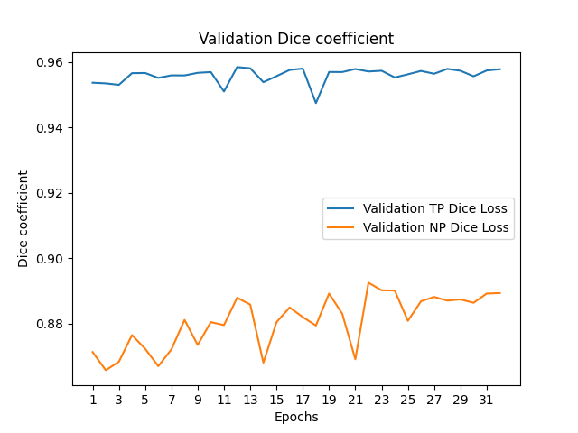

# Segmentation on WSI Images with Hover Net

## Overview
- About the data: Whole Sided Imagess<br />
- Basics of segmentations<br />
- Dataset<br />
- Challenges<br />
- Model<br />
- Training and inference details<br />
- Results on test dataset<br />
- Looking forward<br />


## About the data: Whole Sided Images

Whole sided images, used in digital pathology, are high resolution digital files obtained by scanning a microscope slide, usually at varying magnifications. Often, these images are gigantic, which poses issues pertaining to memory and data processing, hence it is uncommon to practically fit the entire gigapixel image into the GPU. While we could down-sample the said image, which, while aiding the direct usage of a convolutional network and circumventing memory issues, would result in the loss of discriminative details, which is encoded in high resolution patches, thus resulting in suboptimal predictions.<br />
<br />
Moreover, while deep learning techniques have been widely adopted by numerous other fields, labeled data is harder to obtain in case of digital pathology, which limits the usage of supervised approaches. The data available for the purposes of digital pathology is often based on a small sample size and a limited geographic variance  among other factors, which limits the utility and leads to a subpar generalizing capacity of the deep learning model.
Another common dilemma is in relation to the separation of clustered objects, which results from the lack of clear well-defined boundaries in case of objects in the image.<br />
<br />
Class imbalance is a problem often found in datasets concerning applications in the healthcare domain, wherein at least one of the target classes constitutes only a very small minority of the data samples. In other words, the class distribution is not even remotely balanced and is instead skewed. In the dataset made available to me for analysis and reporting, the class label 'red' was found to consist of fewer contours/objects when compared to the other two target labels.<br />
<br />

## Basics of segmentations

The goal of segmentation is to predict class labels for each pixel in the image. Segmentation helps us understand what's in an image and also provides us with a granular understanding of the localized objects that may be present in the image. While the mechanisms for object detection entails drawing a bounding box to highlight the location of the objects, segmentation provides pixel by pixel outlines for each object.<br />
<br />
Moreover, since we are predicting target labels for each pixel of an image, segmentation is a form of a dense prediction problem.
Training data for segmentation models involves the provision of images as inputs and masks, which detail the region of the said image where a specific class is present. The segmentation masks are composed of binary labels for each corresponding pixel and overlay a single channel of the target class, hence masks are generally shaped (image_width * image_height * num_classes).<br />

## Dataset
Our dataset consists of digitized H&E stained whole-slide images (WSI) of biopsies. The whole-slide images (WSI) made by digitizing microscope slides at diagnostic resolution are very large and H&E staining is a routine protocol to enhance the contrast of a tissue section and is commonly used for tumour assessment (grading, staging, etc.). <br />
<br />
In this dataset, we have 3 categories - black (0, 0, 0), yellow (255, 255, 0) and red(255, 0 , 0). <br />

#### Details:
- Train: 5 Images<br />
- Validation: 2 Images<br />
As mentioned above, WSI has very high resolution and in this dataset, they are available in 10k*14k*3  - where 14k is the height, 10k is the width and 3 are number of channels (R, G, B) in the image. <br />

#### Patching

As indicated earlier, we cannot fit an entire Whole Slide Image into the GPU memory at once for processing. As a workaround to this problem, we sample a subset of patches from the image. In other words, the entire WSI is divided into small patches. The quantity and size of patches are thus chosen so as to be sufficiently small enough to be fit in the GPU. Subsequent training is done on a patch level, and the ensuing label for the WSI is computed after aggregating the patch level predictions. <br />
<br />
When we are dealing with dense prediction tasks such as segmentation, an overlap is often incorporated into the patch generation process. Patch overlap is necessitated by the fact that we get poor results at the borders of patches. While overlap may result in more patches, thus slowing the processing of the entire image, it is often found to improve model performance and enhance intra-patch communication. This can also be understood as a form of data augmentation, wherein we increase the number of training patches created from a single region.<br />
<br />
The extraction of patches concerns the following:
- kernel size: determines the dimensions for each individual patch. Thus, simply put, it is the number of pixels per extracted patch.
- step size: the number of pixels between two consecutive patches in the WSI.<br />

In our case, for an input image of dimensions (14k, 12k), the choice of the aforementioned parameters was kernel/patch size: (540, 540) and step size: (256, 256).<br />

Aggregation of patches to predict the final class label is done on patch predictions (for instance, a majority vote) or patch features. Calculating max/mean pooling values, a weighted sum or identification of the most informative patches are some ways to aggregate features for patch level encodings. Local segmentation masks are individually computed for each of the patches extracted from the WSI, and aggregated to obtain the final segmentation mask.<br />
<br />
Total images after patching:

- Train: 6013

#### Sample patch with mask

<p float="left">
  
</p>

### Data Augmentation 

Image augmentation techniques were found to be critical to the performance of the model. Due to the limitations in the availability and the relative expense of annotation of data pertaining to the healthcare domain, it is of utmost importance to artificially generate more training data using augmentation. Also, with the number of training samples made available being insufficient, there is the possibility of overfitting, wherein the model memorizes the training samples so much that it excels, while performing poorly on unseen test data. Augmentation reduces the prospect of overfitting, while increasing diversity of the training samples.<br />
Creating variance in the input images enables the generation of new training samples which helps the model generalize and learn from a wider range of situations.<br />
<br />

- Blur: Blurring an image refers to mixing the values of neighboring pixels, based on some criterion. Thus, blur can be thought of as loss of detail and is determined by the number of neighboring pixels included in the computation across channels. When calculating blur, we take the standard deviation across image channels, with a larger standard deviation implying more blur.<br />
Gaussian Blur implies computation of the average of values in a pixel neighborhood, based on the relative distance to an individual reference pixel. It is a linear operation and the choice of the smoothing parameter determines the preservation of local features.<br />
<br />
Median Blur, unlike Gaussian Blur, is a non-linear operation and involves the computation of the median of the values in the kernel. Also, while Gaussian Blur involves the computation of an artificial value (which may not be present in the original image), the output of Median Blur always refers to some value in the original image.<br />


- Contrast: It implies the variance in the pixel values, and its usage helps us define boundaries in a better manner and highlight subtle differences in pixel values. In case of segmentation, inclusion of contrast as an augmentation technique leads to better generalization as we are able to clearly differentiate the brighter and darker pixels.

- Brightness: It helps us simulate various lighting conditions. Brightness implies the application of a uniform increment or decrement to all pixels in an image. For instance, for the choice of brightness parameter B, the strength of all pixels in the image is +/- the value B.

- Saturation: Definitive of the vibrancy in colors, saturation causes pixels to appear sharper. Less saturation implies faded color schemes (or a grayscale image in an extreme case), while an increase implies a colorful image.

- Hue: It is representative of the color being displayed, and while altering brightness does not change the color (just the intensity), altering hue modifies the color. Usage of hue as an augmentation technique helps generalize the model as it forces the model to consider alternative colors for objects in an image.<br />

<br />
Range of magnitudes for the application of each of the aforementioned transformation was chosen to be:

- Blur<br />
- Gaussian Blur: Size of the Gaussian kernel= (3, 3) and standard deviation is automatically computed using kernel size.<br />
- Median Blur: Size of the kernel to be used for computation of imputed median: (3, 3)

- Brightness: Chosen from a uniformly distributed random variable with the range (-26, 26)

- Contrast: Value for contrast was sampled using a random uniform distribution with range (0.75, 1.25)

- Saturation: Value generated using a random uniform distribution; range= (-0.2, 0.2)

- Hue: Sampled from a uniformly distributed random variable with the range (-8, 8)

## Challenges 
Automated WSI image analysis is plagued by a myriad of challenges. Some of them are listed below:
- Very cost intensive and hard to annotate WSI images.
- Large dimensionality of WSI images - A WSI image is obtained by digitizing a glass slide at a very high resolution on a microscope. A typical glass-slide of size 10 mm*15 mm results in gigapixel image of size 10,000 * 150,000 pixels. 
- Insufficient training samples -  The primary factor to the development and clinical implementation of deep learning algorithms consist of sufficiently large and curated however the WSI data is often based on small sample sizes with limited geographic variety, resulting in algorithms with limited utility and poor generalization.
- Separating clustered objects - It’s one of the major issue in the medical domain as most of the images have objects which share boundary with each other.
- Class imbalance - Like all other datasets, here in our dataset I have seen the problem of unbalanced dataset. The red class has very less contours/objects as compared to other two classes. <br />

## Model
We can broadly divide image segmentation techniques into two types. Consider the below images:
- Semantic segmentation outputs the uncountable objects in an image. It analyzes each image pixel and assigns a unique class label based on the texture it represents. For instance, an image contains two cars and three pedestrians. The two cars represent the same texture as do the three pedestrians. Commonly used semantic segmentation models include DeepLab V3 plus, U-Net, DeconvNet, and FCNs. Semantic segmentation normally employs the Intersection over Union metric - which checks the similarity between the predicted and ground truth masks. <br />
- Instance segmentation typically deals with tasks related to countable objects. It can detect each instance of a class present in an image and assigns it a different mask with a unique identifier. Commonly used instance segmentation techniques are Mask R-CNN, PANet, and YOLACT. The AP is used as a metric for instance segmentation, it uses the IoU on a pixel-to-pixel basis for each object instance.

<p float="left">
  
</p>

## HoverNet 
This model was developed in late 2018 mainly for nuclear segmentation and classification and addresses issues faced by microscopic images such as there are several different types of nuclei, some of them exhibiting large intra-class variability such as the nuclei of tumour cells. In addition to it, some of the nuclei are often clustered together. <br />
Hovernet leverages the instance-rich information encoded within the vertical and horizontal distances of nuclear pixels to their centres of mass. These distances are then utilised to separate clustered nuclei, resulting in an accurate segmentation, particularly in areas with overlapping instances.<br />

#### Data Loader 
A data loader class is used to iterate through the data, returning a tuple with the batch and performs various data augmentations before passing the same through a deep neural network.<br />

#### Architecture
The network architecture of Hover-Net comprises of Encoder-Decoder architecture. The input image size of the network is 270x270x3 where 270 is the height/width of the input patch with 3 being RGB channels of input Images. <br />
##### Encoder Block
The purpose of the encoder in a model is to perform feature extraction on the input image. As we go through the encoder block, just like a multiple layers of CNN the spatial resolution of feature maps decreases and the depth of the feature maps increases.<br />
Encoder block of Hover-Net is as follows:
- The first layer comprises of convolution Layer having a filter size of 7x7 to have a large field of view followed by batch normalization and ReLU as an activation function at the end.
- Post this, ResNet 50 which consists of 4 Residual Blocks having layers ranging from 3 to 6.
-	The last layer of the encoder comprises of 1x1 convolution layer that is mostly used to reduce the depth of the feature map in a neural network.<br />


##### Decoder Block
The objective of using a decoder block is to upsample the features extracted from the encoder block. There are three heads in the decoder which are Nuclear Pixel (Binary segmentation mask of Nuclei), HoVer Branch (generation of horizontal and vertical feature maps) which are used for detection of overlapping nuclei, Nuclear Classification (assigns class label to segmented nuclei).<br />
Decoder block of Hover-Net is as follows:
-	Upsample layer increases the size of the feature map by a factor of 2.
- The 1x1 convolution layer is used to reduce the depth of the upsampled feature maps.

<p float="left">
  
</p>

#### Loss function
A loss function lets know the model of its inability to fit the data, with idea being to converge on an optimum set of parameters.
Hover-Net Loss function consists of 3 terms: HoVer head (Horizontal and Vertical Feature Maps), Nuclear Pixel head (NP), and Nuclear Classification head (NC). <br />
There are two components in hover branch loss function term - La mean squared error between the predicted horizontal and vertical distances and the ground truth. Lb is the mean squared error between the horizontal and vertical gradients of the horizontal and vertical maps respectively and the corresponding gradients of the ground truth.<br />
NP and NC branches, we calculate the cross-entropy loss (Lc and Le) and the dice loss (Ld and Lf ). These two losses are then combined together to give the overall loss of each branch.<br />

<p float="left">
  
</p>

#### Splitting into training and testing data : 
The issue may then be that the model "overfits" the training data and may fail when generalizing to a different subset. So we need for separate training, validation and testing steps which help combat overfitting and data leakage. They help us have the idea of how well our model does on unseen data. In an effort to increase model's performance on validation data, we can tune training hyperparameters, model architecture and make use of data augmentation techniques.<br />

#### Metric

Hovernet uses Dice coefficient - a statistical method which measures the similarity between two sets of data. <br />
The mathematical equation for Dice coefficient is as follows:<br />
2 * |X ∩ Y| / (|X| + |Y|)<br />
<br />
Where X is ground truth object and Y is the predicted object by HoverNet.
<br />

#### Hyper-Parameters
-	Image Size 270x270 and output size is 80*80
-	50 Epochs Training Using Pre-Trained Weights of Resnet 50
-	Adam Optimizer with Learning Rate 0.0001
-	Reduction of Learning Rate to 0.00001 after 25 Epochs
-	Batch_size used while training - 8

#### Repository Structure

Below are the main directories in the repository: 

- `dataloader/`: the data loader and augmentation pipeline
- `docs/`: figures/GIFs used in the repo
- `metrics/`: scripts for metric calculation
- `misc/`: utils that are
- `models/`: model definition, along with the main run step and hyperparameter settings  
- `run_utils/`: defines the train/validation loop and callbacks 

Below are the main executable scripts in the repository:

- `config.py`: configuration file
- `dataset.py`: defines the dataset classes 
- `extract_patches.py`: extracts patches from original images
- `compute_stats.py`: main metric computation script
- `run_train.py`: main training script
- `run_infer.py`: main inference script for tile and WSI processing
- `convert_chkpt_tf2pytorch`: convert tensorflow `.npz` model trained in original repository to pytorch supported `.tar` format.

## Running the Code

#### Training
The training on the model is done by the run_train.py. parameters of note, include:

- --epochs: Number of times the training and validation steps are accomplished by forward and backward passes through network to reach a state of mininma on loss function.
- --batch: Size of the batch which is passed through model on training and validation for steps across the network.
- --img: Image size of the training images. Upon experimentation with this parameter, 270 was chosen to be a good parameter value.
- Multi GPU training was enabled by wraping model object with torch.nn.DataParallel
- GPU used for training : `Tesla V100`
 
Usage: <br />
```
 nohup python run_train.py [--gpu=<id>] [--view=<dset>]
```

#### Inference

In the final step, we should be able to detect objects on unseen images and label them into respective categories (segmentation+classification), which is accomplished by running the command run_infer.py. It has the following arguments most commonly used as per their usage in the model:<br />
- --input_dir: Path to the test image
- --model_path: Path to saved weights
- --img: Size of the test image
- --draw_dot: predicted segmentation drawn on the localized object in the image 

```
nohup python run_infer.py \
--nr_types=3 \
--type_info_path=/home/ubuntu/aira/hover_net/type_info.json \
--batch_size=8 \
--model_mode=original \
--model_path=/home/ubuntu/aira/hover_net/logs/00/net_epoch=33.tar \
tile \
--input_dir=/home/ubuntu/aira/consep/consep/valid/images \
--output_dir=/home/ubuntu/aira/consep/consep/valid/pred/ \
--draw_dot \
```
#### Model weights
[model-weights](https://drive.google.com/file/d/1vQgqDd_UXwWdnJVDx0ErMvW7K5uVx0Ig/view?usp=share_link)

## Quantitative Results

<p float="left">
  
</p>

<p float="left">
  
</p>
<p float="left">
  
</p>
<p float="left">
  
</p>
<p float="left">
  
</p>

## Quantitative Results
<p float="left">
  
</p>
<br />
<br />
<br />
<p float="left">
  
</p>


## Predictions with model
<p float="left">
  
</p>

<p float="left">
  
</p>

<p float="left">
  
</p>

<p float="left">
  
</p>

